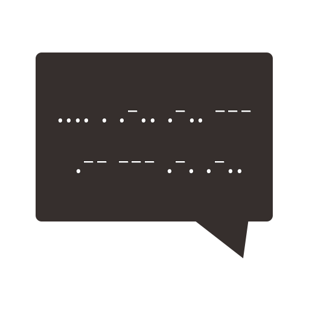
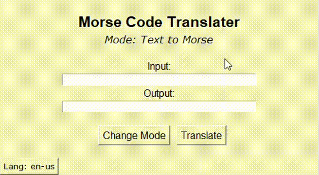
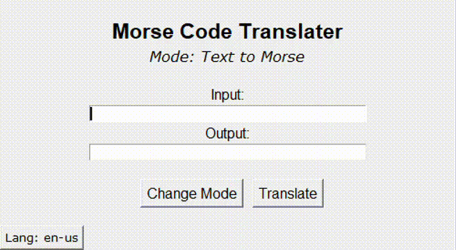

[contributing]: CONTRIBUTING.md
[license]: LICENSE
[requirements]: requirements.txt
[lang]: morse/resources/lang.gif
[demonstration]: morse/resources/demonstration.gif
[author-link]:https://img.shields.io/badge/Author-V%C3%ADtor%20Augusto%20Ueno%20Otto-lightgrey
[language-link]:https://img.shields.io/badge/Language-Python-lightgrey
[license-link]:https://img.shields.io/badge/License-MIT-lightgrey
[star-link]:https://img.shields.io/github/stars/vitorueno/morse-translater?color=lightgray
[star-link]:https://img.shields.io/github/stars/vitorueno/morse-translater?color=lightgray
[contributors-link]:https://img.shields.io/github/contributors/vitorueno/morse-translater?color=lightgray
[fork-link]:https://img.shields.io/github/forks/vitorueno/morse-translater?color=lightgray
[twitter-link]:https://img.shields.io/twitter/url?logoColor=grey&style=social&url=https%3A%2F%2Ftwitter.com%2FUenoOtto

    

# :speech_balloon: Morse Code Translater 

[![author][author-link]](https://github.com/vitorueno)
[![language][language-link]](https://www.python.org/)
[![license][license-link]](https://github.com/vitorueno/morse-translater/blob/master/LICENSE)
[![stars][star-link]](https://github.com/vitorueno/morse-translater/stargazers)
[![contributors][contributors-link]](https://github.com/vitorueno/morse-translater/graphs/contributors)
[![forks][fork-link]](https://github.com/vitorueno/morse-translater/network/members)
[![twitter][twitter-link]](https://twitter.com/UenoOtto)

This repository is about a simple GUI program made with Tkinter (python's standart GUI package) which translates text to morse code and vice-versa. It has both English (en-us) and Portuguese (pt-br) versions. 

# :pushpin: Topics

- [:rocket: Features](#rocket-features)
- [:clipboard: Requirements](#clipboard-requirements)
- [:running: Running the Program](#running-running-the-program)
- [:tada: How to Contribute](#tada-how-to-contribute)
- [:closed_book: License](#closed_book-license)

# :rocket: Features

- Encrypt text to morse code
- Decrypt morse code to normal text
- Choose between English (en-us) or Portuguese (pt-br)

# :clipboard: Requirements

> Python 3.6 or greater 

You don't have to install anything else besides Python since TKinter is pre-installed by default, but if necessary, run `python -m pip install tkinter` in order to install the package.

Check the [requirements.txt][requirements] to see exactly what I've used

# :running: Running the Program

Since this project focuses on the simplicity, only one command is necessary to start the program (make sure to be in the project directory):

> `python -m morse` 

# :chart_with_upwards_trend: Next Steps

I want to continually improve this program even though it's very simple, so these are the main things I will update or include in the future:

- CLI options
- Prettify the GUI
- Fix bugs

# :tada: How to Contribute

Feel free to contribute however you'd like, but checkout my [contributing][contributing] page for more information. 

# :closed_book: License

This project is under [MIT license][license].
